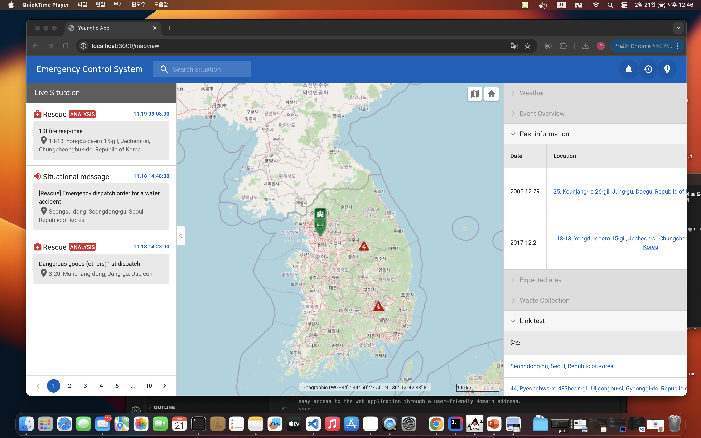
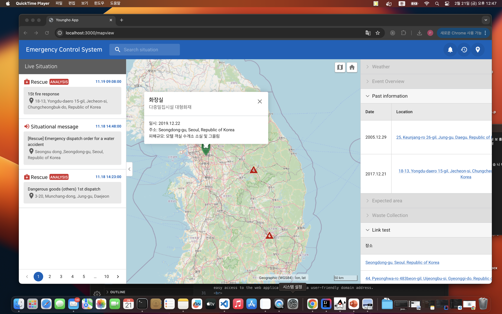
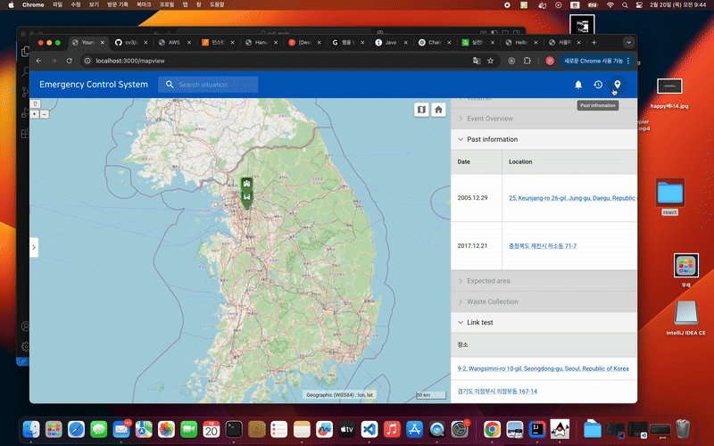

# React Map Application with OpenLayers and OpenStreetMap (OSM)


<div style="display: flex; justify-content: space-around;">
  
  
  
</div>


---
---
<br>

# Feature

1. Interactive Map Display (Powered by OSM Tiles):<br>   
<br> 
<p>
This core feature involves rendering a world map using tiles provided by OpenStreetMap.<br>   The application will dynamically load and display these tiles as the user navigates, ensuring a smooth and seamless experience.   <br> The initial map view could be centered on a specific location, perhaps based on the user's geolocation or a default setting.  
</p>
<br>
<br>

2. Zoom and Pan Functionality (Intuitive Map Exploration): <br>  
<p>
Users will have full control over how they explore the map.<br>   Standard mouse interactions (clicking and dragging to pan, scrolling to zoom) will be supported. <br>  Zoom controls (buttons or a slider) could be included for users who prefer a more traditional interface.  
</p>
<br> 
<br> 

3. Customizable Map Layers (Visualizing Data on the Map): <br>
<p> 
This feature allows for the addition and customization of various layers on top of the base map.  These layers can represent different types of data or features.  Examples include:
  <p>- Markers: Icons or custom images placed on the map to represent specific points of interest (e.g., alrams, events). Clicking on a marker could display a pop-up with detailed information about that location.</p>
  <p>- Lines: Polylines drawn on the map to represent routes, boundaries, or connections between locations. These lines could be styled with different colors, widths, and opacities.</p>
  <p>- Data Integration (Connecting to External Data Sources):  The application will be capable of integrating data from external sources to enrich the map visualization.  Common data formats like GeoJSON will be supported.</p>

</p>
<br> 
<br> 

4. User Interactions (Clicking for Information, Tooltips, etc.):  <br>
<p> 
The application will provide interactive features that allow users to engage with the map.  This goes beyond simple zoom and pan.  Examples include:
  <p>- Click Events: Clicking on a map feature (marker, line, shape) will trigger an action, such as displaying a pop-up window with detailed information about the feature.</p>
  <p>-  Hover Effects: Hovering the mouse over a map feature could highlight the feature or display a tooltip with basic information.</p>
  <p>- Tooltips: Small pop-up boxes that appear when the user hovers over a map feature, providing a brief description or summary.</p>

</p>
<br> 
<br> 

---
---
<br>

# Core technologies

# Core technologies
- **Next.js & React** - UI development with support for Server-Side Rendering (SSR) and Client-Side Rendering (CSR)<br>
- **OpenLayers** - Provides map rendering and interaction features<br>
- **OpenStreetMap (OSM)** - Utilizes open-source map data<br>

---
---
<br>

# Deployment

## 1. Install

```bash
git clone https://github.com/sudoyh/React_Map.git

cd React_Map

npm i init

npm run dev


```


<br>


---
---
<br>

# Full video link 

Youtube : 


[📺 Youtube Link : https://youtu.be/5BOkqBVh2zE ](https://youtu.be/5BOkqBVh2zE)

---
---
<br>

# Demo




---
---